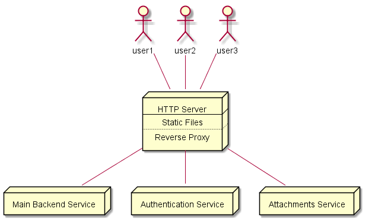
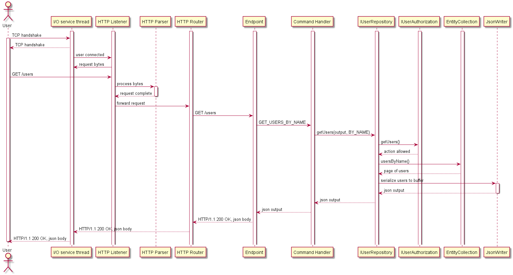
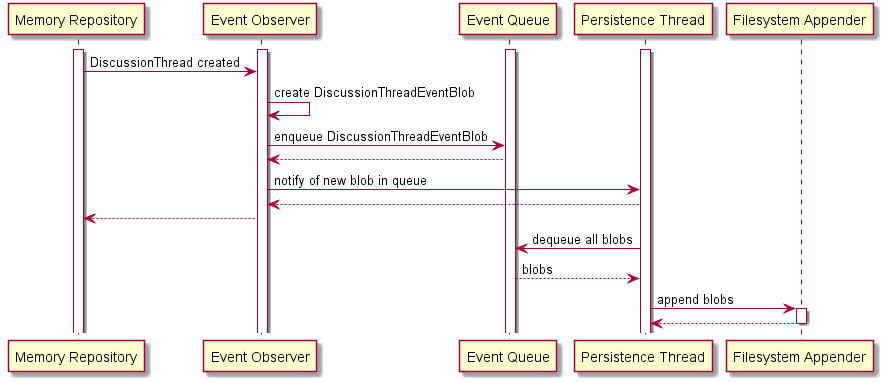

# Fast Forum Backend – Architecture & Implementation Details

## Language Choice

Although controversial, the choice of using C++ as the major implementation language for the forum backend has the
 following objective arguments:

* Better control over lower level operations, with the possibility to optimize where appropriate;
* Fast startup times, no need for a warming up phase;
* Strings can be stored as UTF-8 in memory (for lower memory usage in western languages)
 without going around the language's native string type;
* Granular control over memory allocations and the possibility to prevent them when needed;
* Zero or low cost abstractions;
* Deterministic destruction of objects;
* Simplicity when it comes to deployment: no complex app servers required;
* Powerful cross-platform threading in the standard library;
* Availability of mature libraries (e.g. Boost) which can be used where needed, without forcing the use of a specific
 software architecture.

Subjectively, it is also a good opportunity for experimentation.

## Reinventing The Wheel

Some components written are typical examples of reenventing the wheel. The two major ones are: the HTTP stack and the
 JSON serialization framework.

Reasons for reinventing the wheel include better control over all aspects of the pipeline and
 eliminating operations that are not needed but are by default enabled in various frameworks.

As both the HTTP and JSON components are important member of the request processing pipeline, even minor improvements
 can have a big impact on performance.
  
### HTTP

The maximum size of an allowed input and of a generated output are known at compile time. This allows using a buffer 
 pool for processing HTTP requests and thus eliminates the need to allocate memory when processing each request. 
 
By simply pointing to a memory location of the request buffer, a HTTP header value, for example, can be returned without
 the need to copy its value to a temporary location.

Lazy interpretation of HTTP headers allows a faster processing by skipping those that are not of interest to the application.

### JSON

As no disk¹ is used or network call is made while building a response for an API query, the performance profile shows the 
 serialization code as being slowest step in the pipeline.
 
As such, a well optimized serialization library is key to achieving good performance. The solution written offers this by:

* Streaming the data directly to a buffer, avoiding the creation of temporary objects;    
* Not writing any whitespace – plenty of tools are available to pretty print JSON for debugging;
* Using a look-up table to quickly check if a character needs escaping;
* Quickly generating string representations of integers, without checking localization rules;
* Using templates to deduce the size of constant strings representing attributes names at compile time instead of 
 searching for null-terminators at run-time.
 
[1] Paging might occur if not enough RAM is available.

## High Level Architecture

At a higher level the forum backend is composed of three services:

* **Main content** service: responsible for all the content except file uploads;
* **Authentication** service: allows identifying users, either from a local database, or using a remote service via
 protocols such as _OAuth_ (_not yet implemented_);
* **File** service: responsible for storing and retrieving files attached by users (_not yet implemented_)

These services would normally sit behind a reverse proxy like [NGINX](https://www.nginx.com/resources/wiki/). Their 
 responsibilities are separated so as to allow independent scaling. 

As the authentication and file services would mostly spend time waiting for replies from other services, they can be 
 implemented in any language.

## Processing Requests

Processing HTTP requests occurs as in the following diagram: 

HTTP requests are first accepted using the [Boost.Asio](http://www.boost.org/doc/libs/1_64_0/doc/html/boost_asio.html)
 networking library. A HTTP listener reads input from the socket and passes it to a HTTP parser. 
 
Once the parser returns to the listener that all the bytes that make up the request have been processed, the HTTP request
 is forwarded to a router. The router examines the request path and verb and forwards it to a request endpoint callback.
  
The endpoint interprets various request query parameters and/or cookies and issues a request to a command handler, 
  passing in the id of the command requested and a vector of parameters in the form of strings. 
  
The command handler validates the number of parameters required for each command. String inputs are expected to be UTF-8
 (without BOM). If invalid UTF-8 is found, the request is rejected. String parameters are normalized to NFC form.

The request is then forwarded the request to a repository
 together with a thread local output buffer.
 
The repository (in memory) constructs a JSON output in the buffer provided and returns a status code. The JSON output is 
 forwarded to the client.
 
Multiple threads take turn in reading and writing data over the network. Once a request is ready to be processed, it
 will be processed on the thread that read the last bytes of the request. Construction a reply does not depend on 
 accessing the disk or calling external services and should thus be very fast. 

The repository uses a single writer/multiple reader lock when processing requests. C++ const-correctness helps
 enforce compile time checks for read-only methods.
 
The data is stored in memory using multi-index containers. These allow constant or logarithmic times for querying data
 based on the specified criteria.

## Persistence

As write operations in a discussion forum mostly involve creating new content, the application is a good candidate
 for event sourcing.
  
At the start of the application, all the events located in a source folder are loaded in chronological order and replayed
 in the memory repository. Files containing events are named as `forum-{timestamp}.events` and sorted in order of the 
 timestamp. Interleaving events by timestamp in multiple files is not supported.
 
While the application is running, observers are notified for each event of interest. They quickly serialize the event
 in the form of a BLOB and add the blob to a queue for persistence. Lower-priority events, such as incrementing counters
  storing how many times a discussion thread has been visited, are aggregated and only persisted periodically.
 
A separate thread monitors the queue and writes all the blobs to the filesystem. Thus, normal operations are not blocked
 by expensive I/O. This approach has the downside of loosing some events, should the application or host crash while 
 some events are still in the queue. 
 
> Note: the event queue is of a fixed size. If no room is available to enqueue a blob, the calling thread will wait.

The application can be configured to start using a new file, e.g. after 24h. Files are easily backed up and contain 
 information to verify their integrity.

Periodically, events stored in files can also be cleaned from unwanted content such as spam.
 
### Blob Structure

Each persisted event is stored in the form of BLOB with the following structure:

| Description     | Size      |
| --------------- | --------: |
| Event Type      | 4 bytes   |
| Event Version   | 2 bytes   |
| Context Version | 2 bytes   |
| Actual data     | `n` bytes |

Each BLOB is prefixed by the following information: 

| Description  | Size         | Details                            |
| ------------ | -----------: | ---------------------------------- |
| Magic Number | 8 bytes      | `0xFFFFFFFFFFFFFFFF`               |
| Blob Size    | 4 bytes      |                                    |
| CRC32 Hash   | 4 bytes      | hash of blob bytes without padding |
| Blob         | `size` bytes | padded to a multiple of 8 bytes    |

## Security

The forum backend applications are designed to run with minimal privileges. 

Because a normal deployment would be behind a reverse proxy, each service is able to listen on any HTTP port without
affecting clients and without requiring root privileges if a port > 1024 is chosen.

The responsibility of handling secure connections is also delegated to the reverse proxy server, thus avoiding 
reinventing the wheel in such delicate areas.

The persistence mechanism allows using different folders for reading and writing. This enables:
* Granting read-only access to the source folder;
* Granting write-only access to the destination folder.

## Logging

The logging functionality is being built around [Boost.Log v2](http://www.boost.org/doc/libs/1_64_0/libs/log/doc/html/index.html)
which supports various sinks, from simple ones like stdout or files, to syslog.

## Scalability

The forum backend can scale in multiple ways:

* Vertically, by using more powerful servers;
* Horizontally, by using multiple machines for handing authentication, encrypted connections or attachments;

Vertical scalability is linear for reads but limited for write operations. Using finer-grained locks can improve this. 
Horizontally scaling the memory repository is not possible. It can be enabled by creating a communication protocol
 between multiple instances and partitioning the data.

## Testing

The project contains a number of unit tests. TDD was not employed and the code coverage is below 100%.